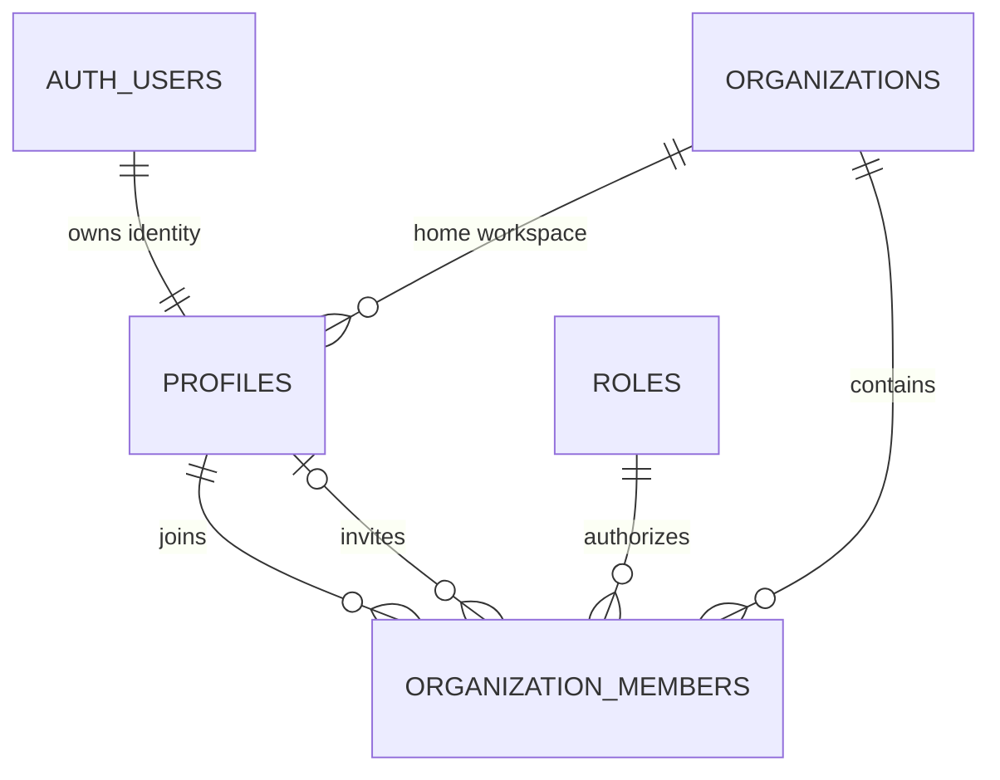

# Identity database and ERD

## Tables

- `organizations` is the tenant boundary and stores name, slug, industry, timezone, lifecycle status, and timestamps.
- `profiles` is a one-to-one extension of `auth.users` and identifies the user’s home organization.
- `organization_members` supports membership across organizations with role, invitation, acceptance, and activation state.
- `roles` contains the seven system roles. Role definitions are global and immutable to authenticated clients.

Foreign keys and RLS lookup columns are indexed. Organizations retain at least one active owner. Updated timestamps are maintained by database triggers.

## Migration

`supabase/migrations/20260720040329_identity_organization_foundation.sql` is the authoritative migration. It was transactionally syntax-checked before being applied to project `uvrigxbzrxbfqgnmaoge`.
